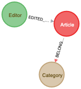

> Vandalism is a deliberate damage to a public property. Wiki’s are publicly owned and managed by the community and vandalism is a big threat to these resources. Vandalism on public platforms can be identified in various forms, especially on Wikipedia. Wikipedia defines vandalism as "any addition, removal, or change of content made in a deliberate attempt to compromise the integrity of Wikipedia". Majority of the vandalism reported occurs when a user deliberately makes incorrect changes to the content of a page, however this type of very tough to detect and we have it listed as our future work to identify such edits. In this work, we have attempted to identify page content vandalism using machine learning and deep learning techniques. However due to limited data and restrictions of the Mediawiki API the problem still remains unsolved.

## Dataset
[PAN Wikipedia Vandalism Detection 2010 @ CLEF](https://webis.de/data/pan-wvc-10.html)

## Files

| Script | Purpose |
|--|--|
|1_feature_extractor.py | computes the hand-crafted features mentioned in this [paper]([https://arxiv.org/abs/1210.5560v1](https://arxiv.org/abs/1210.5560v1))
|2_augment_features.py|This file augments the precomputed features using pyspark and add wordcount and size of article|
|3_build_network.py| This script will build a networkx graph from the data and serializes it to graph.json  this also writes the graph to neo4j database |
|4_generate_embeddings.py| generate node2vec embeddings |
|5_stellar_graphsage.py| apply graphsage algorithm|
|6_evaluate.py| evaluate the classification task|

## Graph data Model


    

- the data consists of three types of nodes and two relationships
    - Editor node
    - Article node
    - Category node
    - EDITED_BY relationship
    - BELONGS_TO relationship

- Example of an Article node

```json
{
  "name": "19952844",
  "_class": 3,
  "label": "editor",
  "feature": [
    22.0,
    12201.0,
    0.0,
    0.0,
    0.0,
    0.0,
    0.0,
    0.0,
    0.0,
    0.0
  ],
  "node_id": 19952844,
  "group": "article"
}
```
- Example of an editor node

```json
{
  "name": "46598",
  "label": "Graham87",
  "_class": 0,
  "feature": [
    1.1583,
    0.1429,
    0.1714,
    0.3333,
    0.4762,
    0.0,
    143.0,
    0.0,
    0.0,
    0.0
  ],
  "group": "editor",
  "node_id": 46598
}

```
- Example of a category node

```json
{
  "name": "527",
  "label": "editor",
  "_class": 4,
  "feature": [
    0,
    0,
    0,
    0,
    0,
    0,
    0,
    0,
    0,
    0
  ],
  "group": "category",
  "node_id": 527
}
```

## Observations:

-	Did dimensionality reduction help?
    -   PCA dimensionality reduction is performed when the features and embeddings are concatenated. 
    -	First two principal components explain 99.8% of total variance. 
    -	The features “size” and “wordcount” correlate highly with principal component 1 which alone explained 98% of total variance. 
    -	However, this didn’t improve the performance much.
-   Did short circuiting the editor nodes improve the classification accuracy?
    - The editor nodes are short circuited by replacing the article and category nodes with edges.
    - This improved the performance by +20%
-	Any patterns observed in the edits that are identified as vandalism?
    -	It was observed that any edit with a vulgar word is undoubtedly identified as vandalism.
    -	The edits which are too small and too large (wordcount) are also identified to be vandalistic attempts.
    -	Anonymous editors are more tend to vandalize that the registered users.

## Experiment setup:
In this report, we shall compare the regular machine learning techniques like logistic regression classifier without including any structural information. 
Later we shall use node2vec to just exploit the structural information from the graph without any node feature information. 
Later we concatenate the node2vec embeddings with the node features and feed it to a downstream application – may be another logistic classifier. 
Later we shall use the graphSAGE and HINSAGE embeddings to see if combining the node features and structural information of nodes improve the results.

## Results
 
classifier | F1_macro@5-fold-cv | Precision_macro@5-fold-cv | Recall_macro@5-fold-cv |
| -- | -- | -- |--|
|Random forest -baseline mentioned in the paper by [Santiago M. Mola Velasco](https://arxiv.org/pdf/1210.5560v1.pdf)| 0.68 | 0.56 | 0.85 |
| Random forest | Train-0.68 Test- 0.67 | Train- 0.65 Test- 0.65 | Train- 0.82 Test- 0.80 |
| Logistic Regression | Train- 0.68 Test- 0.67 | Train- 0.65 Test- 0.65|Train- 0.78 Test- 0.78|
| Node2Vec| Train- 0.48 Test- 0.46	| Train- 0.45 Test- 0.48 | Train- 0.46 Test- 0.47|
| Node2Vec embeddings + features  + Log Regression|  Train- 0.57 Test- 0.59| Train- 0.59 Test- 0.59| Train- 0.58 Test- 0.59|
| Node2Vec embeddings + features + PCA | Train- 0.64 Test- 0.59| Train- 0.61 Test- 0.57 | Train- 0.64 Test- 0.62|
|GraphSAGE |Train- 0.26 Test- 0.26 |	Train- 0.34 Test- 0.34|Train- 0.26 Test- 0.27|
|GraphSAGE with short circuit connections | Train- 0.43 Test- 0.46| Train- 0.46 Test- 0.47|	Train- 0.46 Test- 0.47|

## Neo4j management commands

- create a database dump
  
  `./bin/neo4j-admin dump --database=neo4j --to .`
 - load a database dump
    `./bin/neo4j-admin dump --database=neo4j --from=neo4j.dump`
 
- username - neo4j, password=123/1234 

## Graph visualization 

- Use observables
[Disjoint Force-Directed Graph](https://observablehq.com/d/c96a50d1e20cecee)

## Literature Survey
### References:
1. Hamilton, Will, Zhitao Ying, and Jure Leskovec. "Inductive representation learning on large graphs." Advances in neural information processing systems. 2017. <!-- cited by 1417 nips.cc h-index 169 -->
2. Wu, Zonghan, et al. "A comprehensive survey on graph neural networks." IEEE Transactions on Neural Networks and Learning Systems (2020). <!-- cited by 289 ieee.org -->
3. Monti, Federico, et al. "Geometric deep learning on graphs and manifolds using mixture model cnns." Proceedings of the IEEE Conference on Computer Vision and Pattern Recognition. 2017. <!-- cited by 525, IEEE computer vision, h-score- 245-->
4. Grover, Aditya, and Jure Leskovec. "node2vec: Scalable feature learning for networks." Proceedings of the 22nd ACM SIGKDD international conference on Knowledge discovery and data mining. 2016. <!-- cited by 3004, ACM -->
5. Leskovec, Jure, Jon Kleinberg, and Christos Faloutsos. "Graphs over time: densification laws, shrinking diameters and possible explanations." Proceedings of the eleventh ACM SIGKDD international conference on Knowledge discovery in data mining. 2005. <!--  cited by 2426 -->

### Top Researchers:
1. Jure leskovec, h-index 130
2. Yoshua Bengio, h-index 159
3. William L Hamilton, h-index 19 but more citations on a few works
4. 

### Top Publications
1. Neural Information Processing Systems (h-169)
2. IEEE Transactions on Neural Networks and Learning Systems (h-96)
3. AAAI Conference on Artificial Intelligence (h-95)
4. ACM SIGKDD International Conference on Knowledge Discovery and Data Mining(h-86)
5. International World Wide Web Conferences (WWW). (h-70)

## LICENSE

MIT License

Copyright (c) 2020 Preetham Salehundam

Permission is hereby granted, free of charge, to any person obtaining a copy
of this software and associated documentation files (the "Software"), to deal
in the Software without restriction, including without limitation the rights
to use, copy, modify, merge, publish, distribute, sublicense, and/or sell
copies of the Software, and to permit persons to whom the Software is
furnished to do so, subject to the following conditions:

The above copyright notice and this permission notice shall be included in all
copies or substantial portions of the Software.

THE SOFTWARE IS PROVIDED "AS IS", WITHOUT WARRANTY OF ANY KIND, EXPRESS OR
IMPLIED, INCLUDING BUT NOT LIMITED TO THE WARRANTIES OF MERCHANTABILITY,
FITNESS FOR A PARTICULAR PURPOSE AND NONINFRINGEMENT. IN NO EVENT SHALL THE
AUTHORS OR COPYRIGHT HOLDERS BE LIABLE FOR ANY CLAIM, DAMAGES OR OTHER
LIABILITY, WHETHER IN AN ACTION OF CONTRACT, TORT OR OTHERWISE, ARISING FROM,
OUT OF OR IN CONNECTION WITH THE SOFTWARE OR THE USE OR OTHER DEALINGS IN THE
SOFTWARE.
